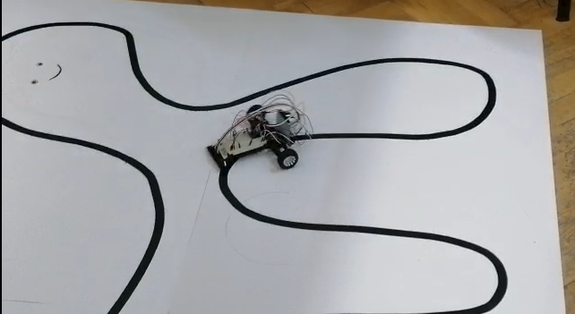

# Line Follower

The line follower robot is built using an Arduino microcontroller and the QTRSensors library. The robot is designed to follow a black line on a white surface and uses a PID control algorithm to adjust the speed of the two motors that drive the robot based on the position of the robot over the line.

## Team Members

### PascalTeam:
* [Andrei Gatej](https://github.com/Andrei0872)
* [Dragos Trandafir](https://github.com/nomoney34)

## Task Requirements

The line follower robot was built with the following requirements in mind:

- A kit that contains the necessary pieces to construct the line follower
- The robot must be calibrated before starting to follow the line
- The robot should move at a fast speed

## Context

This project was done at the Faculty of Mathematics and Informatics as part of the Introduction to Robotics 2022-2023 course. The objective of the project was to build a robot that could complete the course in under 20 seconds. Our team was able to complete the course in 24.6 seconds.

## The Line Follower in Action

The following image shows the line follower robot in action:

  

A video showcasing the functionality of the robot can be found [here](https://youtube.com/shorts/NF3iMSwg8Gc?feature=share).

## Hardware

The robot consists of two motors, six infrared sensors, and an Arduino microcontroller. The infrared sensors are used to detect the position of the black line and the microcontroller is used to control the motors based on the sensor readings.

## Calibration

Before the robot starts following the line, it needs to be calibrated. The calibration process involves measuring the minimum and maximum sensor values when the emitters are on. This allows the robot to adjust its sensitivity to different lighting conditions and surfaces.

## PID Control Algorithm

The robot uses a PID control algorithm to adjust the speed of the motors based on the position of the robot over the line. The algorithm consists of three components:
- Proportional (P) - adjusts the motor speed based on the current error
- Integral (I) - adjusts the motor speed based on the accumulated error over time
- Derivative (D) - adjusts the motor speed based on the rate of change of the error

The algorithm takes the sensor readings and calculates the error, which is the difference between the current position of the robot and the ideal position (center of the line). The error is then used to adjust the motor speeds.

## Code

The code for the line follower robot is divided into several functions:

- `setup()`: This function is called only once at the beginning of the program. It sets up the pin modes for the motors and sensors and calibrates the sensors.
- `loop()`: This function is called repeatedly and contains the main logic of the program. It reads the sensor values, calls the `PID()` function to adjust the motor speeds, and then delays for a period of time before repeating.
- `PID()`: This function takes the error as an input and uses the PID algorithm to adjust the speed of the motors.

## Challenges

During the development of the line follower robot, the team encountered several challenges, including:

- Understanding the underlying principles behind the formula used to control the robot's movement
- Ensuring accurate calibration of the robot

Despite these challenges, the team was able to develop a functional line follower robot that meets the task requirements. However, it is worth noting that the calibration approach used could be improved upon in future iterations.
